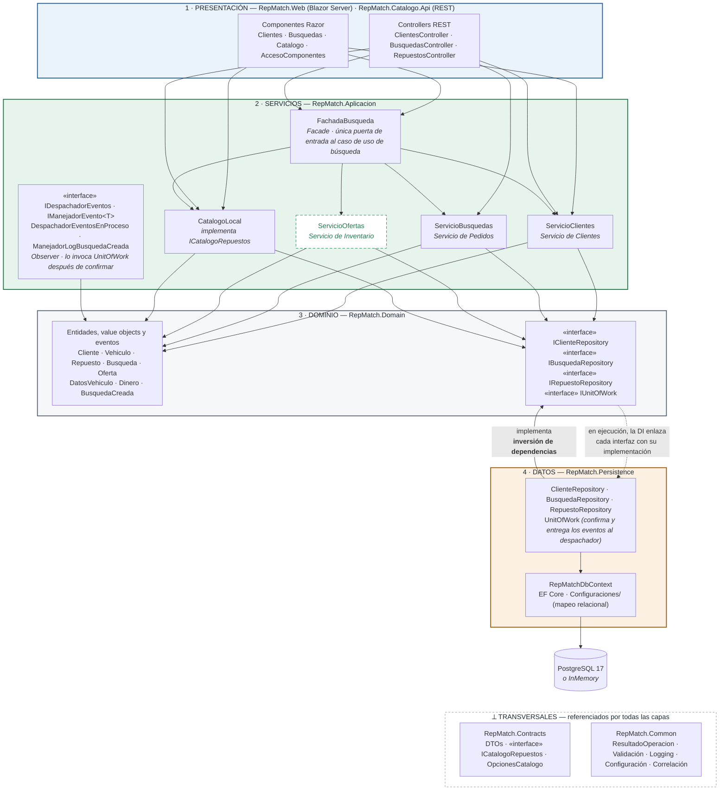
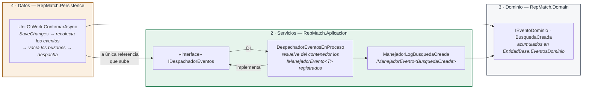

# Diagrama de arquitectura en capas — RepMatch

Cuatro capas con dependencias en un solo sentido: **presentación → servicios → dominio → datos**.
La capa de servicios, que la consigna nombra aparte, es un proyecto propio (`RepMatch.Aplicacion`) y
no se confunde con el dominio: los servicios orquestan casos de uso; el dominio guarda las reglas.

La misma pila se repite en los dos hosts ejecutables: `RepMatch.Web` la usa detrás de los componentes
Razor y `RepMatch.Catalogo.Api` detrás de sus controllers. Los nombres de proyecto son los mismos de
[`componentes.md`](componentes.md).

## Las cuatro capas

| # | Capa | Proyecto | Qué contiene | Sólo puede depender de |
|---|---|---|---|---|
| 1 | **Presentación** | `RepMatch.Web` · `RepMatch.Catalogo.Api` | Componentes Razor, controllers REST, `FabricaCatalogo`, `Program.cs` como raíz de composición | Servicios y transversales |
| 2 | **Servicios** | `RepMatch.Aplicacion` | `FachadaBusqueda`, `ServicioClientes`, `ServicioBusquedas`, `ServicioOfertas`, `CatalogoLocal`, despachador y manejadores de eventos, validadores y mapeadores | Dominio y transversales |
| 3 | **Dominio** | `RepMatch.Domain` | Entidades, value objects, eventos de dominio e **interfaces de repositorio** | *nada* |
| 4 | **Datos** | `RepMatch.Persistence` | `RepMatchDbContext`, configuraciones de EF Core, repositorios, `UnitOfWork` | Dominio y transversales, más `Aplicacion` únicamente por `IDespachadorEventos` |
| ⟂ | Transversales | `RepMatch.Contracts` · `RepMatch.Common` | DTOs e `ICatalogoRepuestos`; `ResultadoOperacion<T>`, validación, logging, configuración, correlación | *nada del proyecto* |
| ↔ | Adaptador remoto | `RepMatch.Clientes.Rest` | `CatalogoRemoto`: proxy HTTP hacia la capa de servicios alojada en `Catalogo.Api` | Transversales |

Los hosts referencian además `Persistence` y `Clientes.Rest`, pero **sólo desde `Program.cs` y
`FabricaCatalogo`** para registrarlos en el contenedor de inyección de dependencias. Ningún componente
Razor ni controller toca un repositorio ni un `DbContext`.

## Diagrama



<!--
  Mantenimiento del diagrama (ojo: dentro de este comentario no puede aparecer la secuencia de dos
  guiones seguidos de mayor, porque cierra el comentario y el resto queda visible en GitHub):
  - Cuando se cierre el issue #4, quitar la linea `class SO previsto` y la leyenda.
  - Las dos aristas entre IREP y REPO (la punteada de la DI que baja y la continua de "implementa"
    que sube) forman un ciclo a proposito: dagre invierte la de "implementa" para el layout y asi la
    capa de datos queda debajo del dominio. Definir siempre la punteada antes que la de "implementa"
    y no agregar aristas (ni invisibles) desde ENT hacia REPO, porque cambian cual de las dos se
    invierte y la capa de datos sube por encima del dominio.
  - Las aristas `~~~` son invisibles y solo fijan el rango: UI ~~~ EVT mantiene al despachador dentro
    de la banda de servicios; BD ~~~ CON/COM deja a los transversales al pie.
-->

**Leyenda.** El único nodo con borde punteado, `ServicioOfertas`, está previsto para la Primera Parte
([#4](https://github.com/lfb-00/tp-apps-2/issues/4)) y todavía no existe en `src/`; el resto es
código que compila hoy. Las flechas continuas son dependencias en tiempo de compilación; la punteada
entre dominio y datos es la resolución en tiempo de ejecución. La referencia que sube de `UnitOfWork`
a `IDespachadorEventos` no se dibuja acá para no romper la lectura por capas: tiene su propio
diagrama más abajo.

## Servicios y dominio: dos capas distintas

La consigna pide *"arquitectura en capas (incluyendo capa de servicios)"*. En RepMatch son dos
proyectos separados que responden preguntas distintas:

| | Capa de servicios — `RepMatch.Aplicacion` | Capa de dominio — `RepMatch.Domain` |
|---|---|---|
| Responde a | *¿qué pasos tiene este caso de uso?* | *¿qué es válido en este negocio?* |
| Contiene | orquestación, validación de entrada, transacción, mapeo a DTO, logging, despacho de eventos | entidades, value objects, invariantes, eventos de dominio |
| Ejemplo | `FachadaBusqueda.ResolverBusquedaAsync`: admite la solicitud, consulta el catálogo, registra la búsqueda y confirma | `Repuesto.EsCompatibleCon`, `Dinero` que se niega a sumar monedas distintas, `Oferta.PrecioTotal` con envío, `Busqueda.OfertasOrdenadasPorPrecio` |
| Conoce | DTOs, `ICatalogoRepuestos`, FluentValidation, `ILogger`, `IUnitOfWork` | nada fuera de sí mismo |
| Devuelve | `ResultadoOperacion<T>` con DTOs | entidades; ante una violación lanza `ExcepcionDominio` |

La prueba de que la separación es real está en `ServicioBusquedas.RegistrarAsync`: el servicio **no
decide** qué códigos van a la búsqueda ni cuándo se marca fallida. Llama a
`busqueda.AsignarCodigosObjetivo(...)` o a `busqueda.Fallar(...)` y traduce la `ExcepcionDominio` a un
resultado fallido. La regla vive en la entidad; el servicio la invoca en el orden correcto. Y la
fachada, un escalón más arriba, tampoco tiene reglas propias: sólo fija el orden de los pasos y qué
hacer si uno falla.

### Los tres servicios y la fachada que pide la consigna

| Consigna | RepMatch | Estado |
|---|---|---|
| Servicio de Clientes | `ServicioClientes` | ✅ implementado |
| Servicio de Pedidos | `ServicioBusquedas` | ✅ implementado |
| Servicio de Inventario | `ServicioOfertas` — RepMatch no maneja stock; gestiona las ofertas capturadas | previsto, [#4](https://github.com/lfb-00/tp-apps-2/issues/4) |
| Facade | `FachadaBusqueda` — una operación de alto nivel, `ResolverBusquedaAsync`, que orquesta el caso de uso de búsqueda | ✅ implementado, `Aplicacion/Fachadas/` |

Desde la presentación, la única forma de crear una búsqueda es pasar por la fachada: los pasos que
mutan estado en `ServicioBusquedas` (`ValidarAsync`, `RegistrarAsync`) son `internal`. Tanto
`Busquedas.razor` como `BusquedasController` llaman a `ResolverBusquedaAsync`, así que los dos hosts
ejecutan exactamente la misma orquestación.

`CatalogoLocal` también vive en esta capa: es el servicio de consulta del catálogo y la implementación
en proceso de `ICatalogoRepuestos`. Su par remoto, `CatalogoRemoto`, queda fuera de la pila porque no
resuelve nada por sí mismo: cruza por HTTP a la misma capa de servicios corriendo en `Catalogo.Api`.

## Dependencias permitidas

Las reglas, todas verificables leyendo los `.csproj`:

1. **Hacia abajo y en un solo sentido.** Presentación → servicios → dominio. Ninguna capa referencia a
   la que tiene encima; el dominio no referencia a nadie. La única excepción, acotada a una interfaz,
   se explica en la sección siguiente.
2. **La presentación nunca usa un repositorio.** `Clientes.razor` inyecta `ServicioClientes`,
   `Busquedas.razor` inyecta `FachadaBusqueda`, `RepuestosController` recibe `ICatalogoRepuestos`.
3. **Los servicios no conocen EF Core.** `RepMatch.Aplicacion.csproj` no referencia `Persistence` ni
   ningún paquete de EF Core; sólo ve las interfaces del dominio.
4. **La capa de datos no contiene reglas de negocio.** `RepuestoRepository.BuscarCompatiblesAsync`
   filtra en la base por marca, modelo y rango de años y delega la regla fina de motorización a
   `Repuesto.EsCompatibleCon`.
5. **Los transversales no dependen de nada del proyecto.** Por eso `Contracts` puede compartirse entre
   `Aplicacion` y `Clientes.Rest` sin arrastrar el dominio a un cliente HTTP.

Referencias de proyecto tal como están declaradas hoy:

| Proyecto | Capa | `ProjectReference` a |
|---|---|---|
| `RepMatch.Domain` | Dominio | — |
| `RepMatch.Common` | Transversal | — (sólo NuGet) |
| `RepMatch.Contracts` | Transversal | — |
| `RepMatch.Persistence` | Datos | `Domain`, `Common`, `Aplicacion` (sólo por `IDespachadorEventos`) |
| `RepMatch.Aplicacion` | Servicios | `Domain`, `Common`, `Contracts` |
| `RepMatch.Clientes.Rest` | Adaptador remoto | `Common`, `Contracts` |
| `RepMatch.Catalogo.Api` | Presentación (host) | `Aplicacion`, `Persistence`, `Domain`, `Common`, `Contracts` |
| `RepMatch.Web` | Presentación (host) | `Aplicacion`, `Persistence`, `Clientes.Rest`, `Domain`, `Common`, `Contracts` |

Para comprobarlo:

```bash
grep ProjectReference src/*/*.csproj
```

## Inversión de dependencias

Entre dominio y datos el diagrama tiene flechas en los dos sentidos, y no es un error. La flecha
continua que sube, **implementa**, es la dependencia de compilación: `RepMatch.Persistence` referencia
a `RepMatch.Domain` y no al revés. Las interfaces `IClienteRepository`, `IBusquedaRepository`,
`IRepuestoRepository` e `IUnitOfWork` están declaradas en `Domain/Repositorios/` y sus implementaciones
en `Persistence/Repositorios/` y `Persistence/UnitOfWork.cs`.

La flecha punteada que baja es lo que pasa en ejecución: el contenedor enlaza cada interfaz con su
implementación en un único punto, y los servicios llaman a la interfaz sin saber qué hay detrás.

```csharp
// RepMatch.Domain/Repositorios/IUnitOfWork.cs — declarada en el dominio
public interface IUnitOfWork
{
    Task<int> ConfirmarAsync(CancellationToken ct = default);
}

// RepMatch.Persistence/ExtensionesPersistencia.cs — enlazada en la capa de datos
servicios.AddScoped<IClienteRepository, ClienteRepository>();
servicios.AddScoped<IRepuestoRepository, RepuestoRepository>();
servicios.AddScoped<IBusquedaRepository, BusquedaRepository>();
servicios.AddScoped<IUnitOfWork, UnitOfWork>();
```

Dos consecuencias concretas:

- `RepMatch.Domain` se prueba sin base de datos ni contenedores (`tests/RepMatch.Tests/Dominio/`).
- Cambiar `Persistencia:Proveedor` entre `InMemory` y `Postgres` no toca ni un servicio: la decisión
  se toma en `ExtensionesPersistencia` y la capa de servicios no se entera.

## La excepción: la capa de datos mira hacia arriba por los eventos

`UnitOfWork` cierra el patrón Observer: después de confirmar la transacción recolecta los eventos que
acumularon las entidades y se los entrega a `IDespachadorEventos`. Esa interfaz vive en la capa de
servicios, así que `Persistence` referencia a `Aplicacion`. Es la dirección habitual de la arquitectura
limpia —infraestructura → aplicación → dominio— y **no forma ciclo**: `Aplicacion` sigue sin conocer a
`Persistence`.



El dominio no gana ninguna referencia con esto: las entidades sólo acumulan eventos en
`EntidadBase.EventosDominio` y no conocen al despachador ni a los manejadores. Sumar un observador es
registrar otro `IManejadorEvento<T>` en `ExtensionesAplicacion`. En la Segunda Parte el despachador en
proceso se reemplaza por uno que publica en RabbitMQ, sin tocar `UnitOfWork`, las entidades ni los
manejadores. El detalle del recorrido está en
[`componentes.md`](componentes.md#eventos-de-dominio-observer).

## El acceso remoto en esta vista

`Catalogo.Api` aloja la misma pila: controllers → fachada y servicios → `IRepuestoRepository` → EF Core.
En modo `Remoto`, `FabricaCatalogo` le da a la presentación de la Web un `CatalogoRemoto`
(`RepMatch.Clientes.Rest`) en lugar de `CatalogoLocal`; el pedido cruza por HTTP a la capa de
presentación de `Catalogo.Api` y desde ahí baja por las mismas capas. Ningún consumidor cambia. El
detalle de ese mecanismo está en [`componentes.md`](componentes.md) y la topología de procesos en
[`despliegue.md`](despliegue.md).
