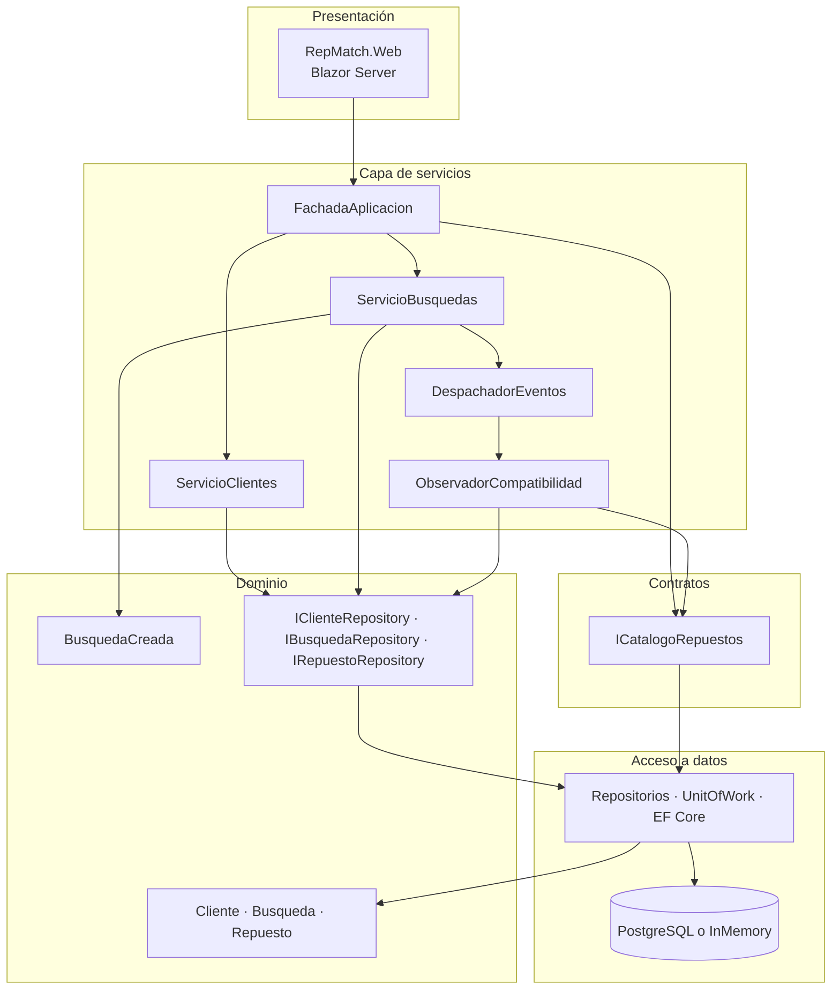

# Diagrama de arquitectura en capas — Primera Parte

Incluye la capa de servicios que pide la Primera Parte, la fachada por la que entra la presentación
y el despacho de eventos entre módulos.

```mermaid
flowchart TB
    subgraph presentacion["Presentación"]
        WEB["RepMatch.Web<br/>Blazor Server"]
    end

    subgraph servicios["Capa de servicios"]
        FAC["FachadaAplicacion"]
        SC["ServicioClientes"]
        SB["ServicioBusquedas"]
        DES["DespachadorEventos"]
        OBS["ObservadorCompatibilidad"]
    end

    subgraph contratos["Contratos"]
        IC["ICatalogoRepuestos"]
    end

    subgraph dominio["Dominio"]
        ENT["Cliente · Busqueda · Repuesto"]
        EV["BusquedaCreada"]
        REPO["IClienteRepository · IBusquedaRepository · IRepuestoRepository"]
    end

    subgraph datos["Acceso a datos"]
        PER["Repositorios · UnitOfWork · EF Core"]
        BD[("PostgreSQL o InMemory")]
    end

    WEB --> FAC
    FAC --> SC
    FAC --> SB
    FAC --> IC
    SB --> DES
    DES --> OBS
    OBS --> IC
    SC --> REPO
    SB --> REPO
    OBS --> REPO
    SB --> EV
    IC --> PER
    REPO --> PER
    PER --> ENT
    PER --> BD
```

La presentación no referencia repositorios ni el despachador. `ServicioBusquedas` persiste la
búsqueda y publica `BusquedaCreada`. El observador, no el servicio, consulta el catálogo.
