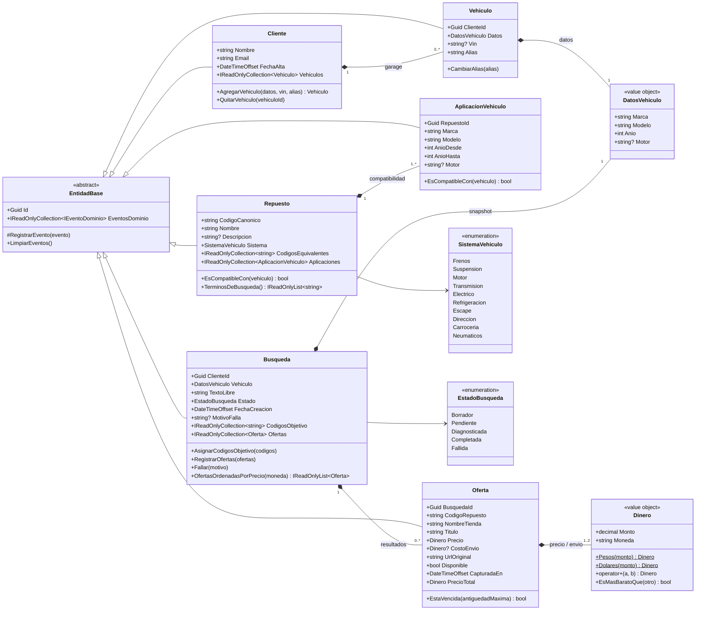

# Diagrama de clases — RepMatch

Modelo del componente de dominio (`RepMatch.Domain`). No tiene dependencias externas: ni EF Core,
ni ASP.NET, ni atributos de persistencia. El mapeo relacional vive aparte, en
`RepMatch.Persistence/Configuraciones/`.

## Mapeo con la consigna

La consigna del TP Inicial pide un componente de dominio con `Pedido`, `Cliente` y `Producto`.
Como la aplicación es un comparador y no un e-shop, esos tres conceptos se materializan así:

| Consigna | RepMatch | Por qué |
|---|---|---|
| Cliente | `Cliente` | Igual: quien usa el comparador, con su garage de vehículos. |
| Producto | `Repuesto` + `Oferta` | `Repuesto` es la pieza como concepto (código canónico, equivalencias, compatibilidad); `Oferta` es esa pieza publicada por una tienda concreta a un precio concreto. Separarlos es lo que permite comparar la misma pieza entre sitios. |
| Pedido | `Busqueda` | El agregado que atraviesa todo el sistema. No se compra nada: lo que se "despacha" es la consulta a las tiendas. |

## Diagrama

## Decisiones que el diagrama refleja

**`DatosVehiculo` es value object, `Vehiculo` es entidad.** El vehículo del garage tiene identidad
propia (el cliente le pone un alias). La búsqueda, en cambio, guarda un *snapshot* de los datos: si
mañana el cliente borra el auto, la búsqueda histórica sigue siendo interpretable.

**`Dinero` existe para que no se puedan sumar monedas distintas.** El comparador mezcla ofertas en
ARS (tiendas VTEX argentinas) y en USD (eBay). Sumarlas sin cotización daría un ranking mentiroso,
así que el tipo lo prohíbe y lanza `ExcepcionDominio`.

**`Oferta.PrecioTotal` incluye el envío.** Ordenar por precio de lista haría ganar a una oferta
barata con envío carísimo. El ranking usa siempre el total.

**Las colecciones se exponen como `IReadOnlyCollection`.** Modificarlas obliga a pasar por un método
de la entidad, que es donde viven las invariantes. EF Core escribe directamente los campos privados
de respaldo (`PropertyAccessMode.Field`).
