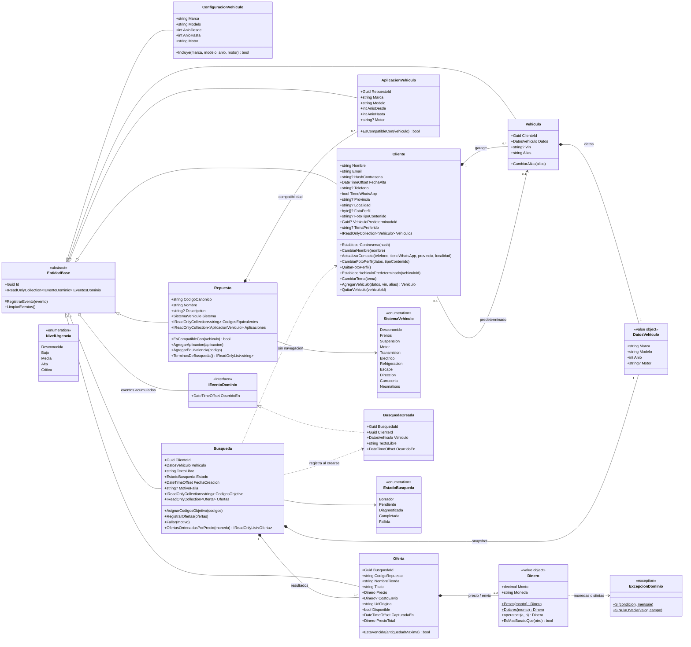
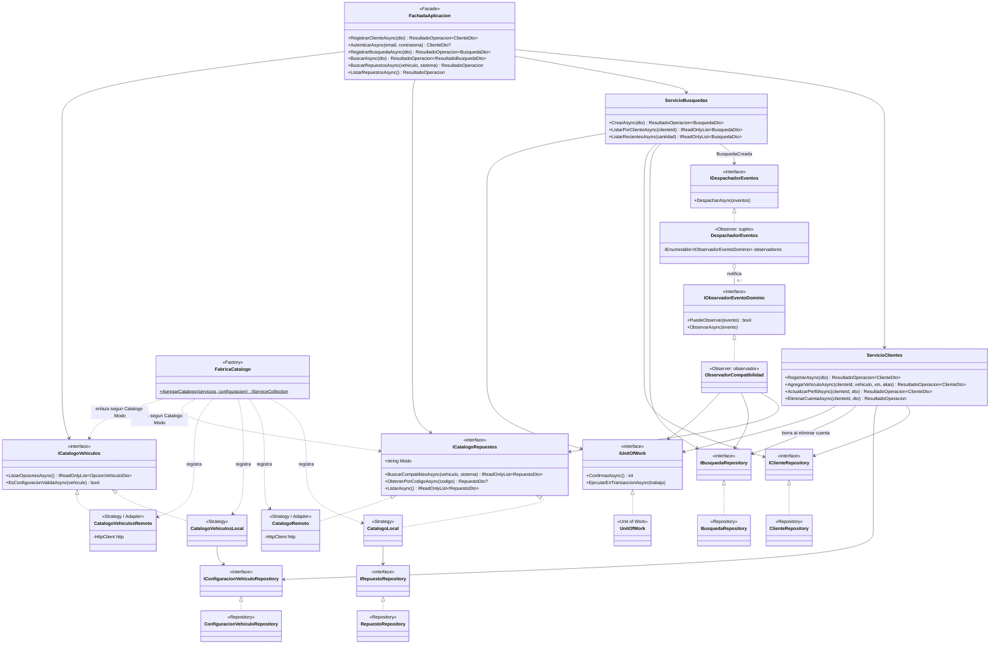

# Diagrama de clases — RepMatch

Dos diagramas. El primero es el modelo del componente de dominio (`RepMatch.Domain`), que no tiene
dependencias externas: ni EF Core, ni ASP.NET, ni atributos de persistencia. El mapeo relacional vive
aparte, en `RepMatch.Persistence/Configuraciones/`. El segundo muestra las clases de las otras capas
donde viven los patrones que pide la Primera Parte (Factory, Repository, Strategy, Observer y Facade),
más Unit of Work y Adapter.

## Mapeo con la consigna

La consigna del TP Inicial pide un componente de dominio con `Pedido`, `Cliente` y `Producto`.
Como la aplicación es un comparador y no un e-shop, esos tres conceptos se materializan así:

| Consigna | RepMatch | Por qué |
|---|---|---|
| Cliente | `Cliente` | Igual: quien usa el comparador, con su garage de vehículos. |
| Producto | `Repuesto` + `Oferta` | `Repuesto` es la pieza como concepto (código canónico, equivalencias, compatibilidad); `Oferta` es esa pieza publicada por una tienda concreta a un precio concreto. Separarlos es lo que permite comparar la misma pieza entre sitios. |
| Pedido | `Busqueda` | El agregado de la consulta: vehículo, texto libre, estado y códigos objetivo. `Oferta` es el tipo preparado para el resultado de una tienda; esta entrega no captura ofertas. |

## Modelo de dominio

```mermaid
classDiagram
    direction LR

    class EntidadBase {
        <<abstract>>
        +Guid Id
        +IReadOnlyCollection~IEventoDominio~ EventosDominio
        #RegistrarEvento(evento)
        +LimpiarEventos()
    }

    class DatosVehiculo {
        <<value object>>
        +string Marca
        +string Modelo
        +int Anio
        +string? Motor
    }

    class Dinero {
        <<value object>>
        +decimal Monto
        +string Moneda
        +Pesos(monto)$ Dinero
        +Dolares(monto)$ Dinero
        +operator+(a, b) Dinero
        +EsMasBaratoQue(otro) bool
    }

    class Cliente {
        +string Nombre
        +string Email
        +string? HashContrasena
        +DateTimeOffset FechaAlta
        +string? Telefono
        +bool TieneWhatsApp
        +string? Provincia
        +string? Localidad
        +byte[]? FotoPerfil
        +string? FotoTipoContenido
        +Guid? VehiculoPredeterminadoId
        +string? TemaPreferido
        +IReadOnlyCollection~Vehiculo~ Vehiculos
        +EstablecerContrasena(hash)
        +CambiarNombre(nombre)
        +ActualizarContacto(telefono, tieneWhatsApp, provincia, localidad)
        +CambiarFotoPerfil(datos, tipoContenido)
        +QuitarFotoPerfil()
        +EstablecerVehiculoPredeterminado(vehiculoId)
        +CambiarTema(tema)
        +AgregarVehiculo(datos, vin, alias) Vehiculo
        +QuitarVehiculo(vehiculoId)
    }

    class Vehiculo {
        +Guid ClienteId
        +DatosVehiculo Datos
        +string? Vin
        +string Alias
        +CambiarAlias(alias)
    }

    class ConfiguracionVehiculo {
        +string Marca
        +string Modelo
        +int AnioDesde
        +int AnioHasta
        +string Motor
        +Incluye(marca, modelo, anio, motor) bool
    }

    class Repuesto {
        +string CodigoCanonico
        +string Nombre
        +string? Descripcion
        +SistemaVehiculo Sistema
        +IReadOnlyCollection~string~ CodigosEquivalentes
        +IReadOnlyCollection~AplicacionVehiculo~ Aplicaciones
        +EsCompatibleCon(vehiculo) bool
        +AgregarAplicacion(aplicacion)
        +AgregarEquivalencia(codigo)
        +TerminosDeBusqueda() IReadOnlyList~string~
    }

    class AplicacionVehiculo {
        +Guid RepuestoId
        +string Marca
        +string Modelo
        +int AnioDesde
        +int AnioHasta
        +string? Motor
        +EsCompatibleCon(vehiculo) bool
    }

    class Busqueda {
        +Guid ClienteId
        +DatosVehiculo Vehiculo
        +string TextoLibre
        +EstadoBusqueda Estado
        +DateTimeOffset FechaCreacion
        +string? MotivoFalla
        +IReadOnlyCollection~string~ CodigosObjetivo
        +IReadOnlyCollection~Oferta~ Ofertas
        +AsignarCodigosObjetivo(codigos)
        +RegistrarOfertas(ofertas)
        +Fallar(motivo)
        +OfertasOrdenadasPorPrecio(moneda) IReadOnlyList~Oferta~
    }

    class Oferta {
        +Guid BusquedaId
        +string CodigoRepuesto
        +string NombreTienda
        +string Titulo
        +Dinero Precio
        +Dinero? CostoEnvio
        +string UrlOriginal
        +bool Disponible
        +DateTimeOffset CapturadaEn
        +Dinero PrecioTotal
        +EstaVencida(antiguedadMaxima) bool
    }

    class SistemaVehiculo {
        <<enumeration>>
        Desconocido
        Frenos
        Suspension
        Motor
        Transmision
        Electrico
        Refrigeracion
        Escape
        Direccion
        Carroceria
        Neumaticos
    }

    class IEventoDominio {
        <<interface>>
        +DateTimeOffset OcurridoEn
    }

    class BusquedaCreada {
        +Guid BusquedaId
        +Guid ClienteId
        +DatosVehiculo Vehiculo
        +string TextoLibre
        +DateTimeOffset OcurridoEn
    }

    class EstadoBusqueda {
        <<enumeration>>
        Borrador
        Pendiente
        Diagnosticada
        Completada
        Fallida
    }

    class NivelUrgencia {
        <<enumeration>>
        Desconocida
        Baja
        Media
        Alta
        Critica
    }

    class ExcepcionDominio {
        <<exception>>
        +Si(condicion, mensaje)$
        +SiNulaOVacia(valor, campo)$
    }

    EntidadBase <|-- ConfiguracionVehiculo
    EntidadBase <|-- Cliente
    EntidadBase <|-- Vehiculo
    EntidadBase <|-- Repuesto
    EntidadBase <|-- AplicacionVehiculo
    EntidadBase <|-- Busqueda
    EntidadBase <|-- Oferta

    Cliente "1" *-- "0..*" Vehiculo : garage
    Cliente "0..1" --> "0..1" Vehiculo : predeterminado
    Vehiculo *-- "1" DatosVehiculo : datos
    Repuesto "1" *-- "0..*" AplicacionVehiculo : compatibilidad
    Repuesto --> SistemaVehiculo
    Busqueda *-- "1" DatosVehiculo : snapshot
    Busqueda ..> Cliente : ClienteId sin navegacion
    Busqueda "1" *-- "0..*" Oferta : resultados
    Busqueda --> EstadoBusqueda
    IEventoDominio <|.. BusquedaCreada
    EntidadBase o-- IEventoDominio : eventos acumulados
    Busqueda ..> BusquedaCreada : registra al crearse
    Oferta *-- "1..2" Dinero : precio / envio
    Dinero ..> ExcepcionDominio : monedas distintas
```

## Decisiones que el diagrama refleja

**`DatosVehiculo` es value object, `Vehiculo` es entidad.** El vehículo del garage tiene identidad
propia (el cliente le pone un alias). La búsqueda, en cambio, guarda un *snapshot* de los datos: si
mañana el cliente borra el auto, la búsqueda histórica sigue siendo interpretable.

**`Dinero` existe para que no se puedan sumar monedas distintas.** El comparador mezcla ofertas en
ARS (tiendas VTEX argentinas) y en USD (eBay). Sumarlas sin cotización daría un ranking mentiroso,
así que el tipo lo prohíbe y lanza `ExcepcionDominio`.

**`Oferta.PrecioTotal` incluye el envío.** `OfertasOrdenadasPorPrecio` ordena por ese total y
rechaza mezclar monedas. La aplicación no llama `RegistrarOfertas` ni ese ranking: la colección de
ofertas queda vacía. Las pruebas de dominio y de persistencia sí ejercen el método.

**Estados que la aplicación alcanza.** El constructor deja la búsqueda en `Pendiente`.
`AsignarCodigosObjetivo` pasa a `Diagnosticada` y `Fallar` a `Fallida`. `Completada` solo la asigna
`RegistrarOfertas`. `Borrador` existe en la enumeración, pero ningún método lo asigna.

**Tipos declarados que la aplicación todavía no usa.** `NivelUrgencia` no lo referencia ninguna
entidad ni servicio, y `Oferta.EstaVencida` no lo llama nadie. Se dibujan porque están en el
componente, aunque hoy no los use ningún flujo.

**Las invariantes se rompen con `ExcepcionDominio`.** Todas las entidades y value objects la lanzan
desde sus constructores y métodos (`Si`, `SiNulaOVacia`); en el diagrama se dibuja una sola
dependencia, la de `Dinero`, para no cruzar todo el modelo de flechas. Los servicios de aplicación
la atrapan y la convierten en `ResultadoOperacion`.

**La búsqueda guarda `ClienteId` y no una navegación hacia `Cliente`.** No hay clave foránea. Si el
cliente borra la cuenta, las búsquedas se eliminan en el servicio, no por cascada de la base.

**El perfil del cliente protege sus invariantes.** La foto no puede estar vacía, tiene que ser JPG,
PNG o WEBP y no puede superar 5 MB. El teléfono admite dígitos, espacios, guiones, paréntesis y un
`+` inicial, entre 8 y 20 caracteres. El tema solo puede ser `"claro"` u `"oscuro"`. La provincia se
guarda como texto y no como enumeración: es un dato de contacto, no algo sobre lo que el dominio
decida. No hay ningún método para cambiar el email.

**El vehículo predeterminado tiene que ser del propio garage.** `EstablecerVehiculoPredeterminado`
rechaza un vehículo ajeno, y `QuitarVehiculo` limpia el predeterminado si se quita ese auto. Se
guarda solo el `Id` (sin navegación); en la base es una FK opcional con `ON DELETE SET NULL`.

**Las colecciones se exponen como `IReadOnlyCollection`.** Modificarlas obliga a pasar por un método
de la entidad, que es donde viven las invariantes. EF Core escribe directamente los campos privados
de respaldo (`PropertyAccessMode.Field`).

## Clases de los patrones

El modelo de dominio no muestra los patrones de la Primera Parte: viven en `Aplicacion`,
`Persistence`, `Clientes.Rest`, `Contracts` y `Web`, y operan sobre las entidades de arriba. Este
diagrama muestra solo esas clases, con los miembros que intervienen en cada patrón. El detalle de
cada uno (qué problema resuelve, qué pasaría sin él, código) está en [patrones.md](../patrones.md).

```mermaid
classDiagram
    direction TB

    class FachadaAplicacion {
        <<Facade>>
        +RegistrarClienteAsync(dto) ResultadoOperacion~ClienteDto~
        +AutenticarAsync(email, contrasena) ClienteDto?
        +RegistrarBusquedaAsync(dto) ResultadoOperacion~BusquedaDto~
        +BuscarAsync(dto) ResultadoOperacion~ResultadoBusquedaDto~
        +BuscarRepuestosAsync(vehiculo, sistema) ResultadoOperacion
        +ListarRepuestosAsync() ResultadoOperacion
    }

    class ServicioClientes {
        +RegistrarAsync(dto) ResultadoOperacion~ClienteDto~
        +AgregarVehiculoAsync(clienteId, vehiculo, vin, alias) ResultadoOperacion~ClienteDto~
        +ActualizarPerfilAsync(clienteId, dto) ResultadoOperacion~ClienteDto~
        +EliminarCuentaAsync(clienteId, dto) ResultadoOperacion
    }

    class ServicioBusquedas {
        +CrearAsync(dto) ResultadoOperacion~BusquedaDto~
        +ListarPorClienteAsync(clienteId) IReadOnlyList~BusquedaDto~
        +ListarRecientesAsync(cantidad) IReadOnlyList~BusquedaDto~
    }

    class FabricaCatalogo {
        <<Factory>>
        +AgregarCatalogo(servicios, configuracion)$ IServiceCollection
    }

    class ICatalogoRepuestos {
        <<interface>>
        +string Modo
        +BuscarCompatiblesAsync(vehiculo, sistema) IReadOnlyList~RepuestoDto~
        +ObtenerPorCodigoAsync(codigo) RepuestoDto?
        +ListarAsync() IReadOnlyList~RepuestoDto~
    }

    class CatalogoLocal {
        <<Strategy>>
    }

    class CatalogoRemoto {
        <<Strategy / Adapter>>
        -HttpClient http
    }

    class ICatalogoVehiculos {
        <<interface>>
        +ListarOpcionesAsync() IReadOnlyList~OpcionVehiculoDto~
        +EsConfiguracionValidaAsync(vehiculo) bool
    }

    class CatalogoVehiculosLocal {
        <<Strategy>>
    }

    class CatalogoVehiculosRemoto {
        <<Strategy / Adapter>>
        -HttpClient http
    }

    class IDespachadorEventos {
        <<interface>>
        +DespacharAsync(eventos)
    }

    class DespachadorEventos {
        <<Observer: sujeto>>
        -IEnumerable~IObservadorEventoDominio~ observadores
    }

    class IObservadorEventoDominio {
        <<interface>>
        +PuedeObservar(evento) bool
        +ObservarAsync(evento)
    }

    class ObservadorCompatibilidad {
        <<Observer: observador>>
    }

    class IClienteRepository {
        <<interface>>
    }
    class IBusquedaRepository {
        <<interface>>
    }
    class IRepuestoRepository {
        <<interface>>
    }
    class IConfiguracionVehiculoRepository {
        <<interface>>
    }
    class ClienteRepository {
        <<Repository>>
    }
    class BusquedaRepository {
        <<Repository>>
    }
    class RepuestoRepository {
        <<Repository>>
    }
    class ConfiguracionVehiculoRepository {
        <<Repository>>
    }

    class IUnitOfWork {
        <<interface>>
        +ConfirmarAsync() int
        +EjecutarEnTransaccionAsync(trabajo)
    }

    class UnitOfWork {
        <<Unit of Work>>
    }

    FachadaAplicacion --> ServicioClientes
    FachadaAplicacion --> ServicioBusquedas
    FachadaAplicacion --> ICatalogoRepuestos
    FachadaAplicacion --> ICatalogoVehiculos

    FabricaCatalogo ..> CatalogoLocal : registra
    FabricaCatalogo ..> CatalogoRemoto : registra
    FabricaCatalogo ..> CatalogoVehiculosLocal : registra
    FabricaCatalogo ..> CatalogoVehiculosRemoto : registra
    FabricaCatalogo ..> ICatalogoRepuestos : enlaza segun Catalogo Modo
    FabricaCatalogo ..> ICatalogoVehiculos : enlaza segun Catalogo Modo

    ICatalogoRepuestos <|.. CatalogoLocal
    ICatalogoRepuestos <|.. CatalogoRemoto
    ICatalogoVehiculos <|.. CatalogoVehiculosLocal
    ICatalogoVehiculos <|.. CatalogoVehiculosRemoto

    ServicioBusquedas --> IDespachadorEventos : BusquedaCreada
    IDespachadorEventos <|.. DespachadorEventos
    DespachadorEventos o-- "0..*" IObservadorEventoDominio : notifica
    IObservadorEventoDominio <|.. ObservadorCompatibilidad
    ObservadorCompatibilidad --> ICatalogoRepuestos

    ServicioClientes --> IClienteRepository
    ServicioClientes --> IConfiguracionVehiculoRepository
    ServicioClientes --> IBusquedaRepository : borra al eliminar cuenta
    ServicioBusquedas --> IBusquedaRepository
    ServicioBusquedas --> IClienteRepository
    ObservadorCompatibilidad --> IBusquedaRepository
    CatalogoLocal --> IRepuestoRepository
    CatalogoVehiculosLocal --> IConfiguracionVehiculoRepository

    IClienteRepository <|.. ClienteRepository
    IBusquedaRepository <|.. BusquedaRepository
    IRepuestoRepository <|.. RepuestoRepository
    IConfiguracionVehiculoRepository <|.. ConfiguracionVehiculoRepository

    ServicioClientes --> IUnitOfWork
    ServicioBusquedas --> IUnitOfWork
    ObservadorCompatibilidad --> IUnitOfWork
    IUnitOfWork <|.. UnitOfWork
```

| Patrón | Clases en el diagrama | Proyecto |
|---|---|---|
| Factory | `FabricaCatalogo.AgregarCatalogo` | `RepMatch.Web` |
| Strategy | `ICatalogoRepuestos` / `ICatalogoVehiculos` con sus implementaciones `*Local` y `*Remoto` | `Contracts`, `Aplicacion`, `Clientes.Rest` |
| Adapter | `CatalogoRemoto`, `CatalogoVehiculosRemoto` (HTTP → contrato) | `RepMatch.Clientes.Rest` |
| Repository | `I*Repository` (interfaces) y `*Repository` (EF Core) | `Domain` y `Persistence` |
| Unit of Work | `IUnitOfWork` / `UnitOfWork` | `Domain` y `Persistence` |
| Observer | `IDespachadorEventos`, `DespachadorEventos`, `IObservadorEventoDominio`, `ObservadorCompatibilidad`; el evento `BusquedaCreada` está en el modelo de dominio | `Aplicacion` y `Domain` |
| Facade | `FachadaAplicacion` | `RepMatch.Aplicacion` |

Las interfaces de repositorio y de unidad de trabajo pertenecen al componente de dominio aunque se
dibujen acá: el dominio declara qué necesita y `Persistence` lo implementa, por eso la flecha de
dependencia apunta de la capa de datos hacia el dominio y no al revés.
