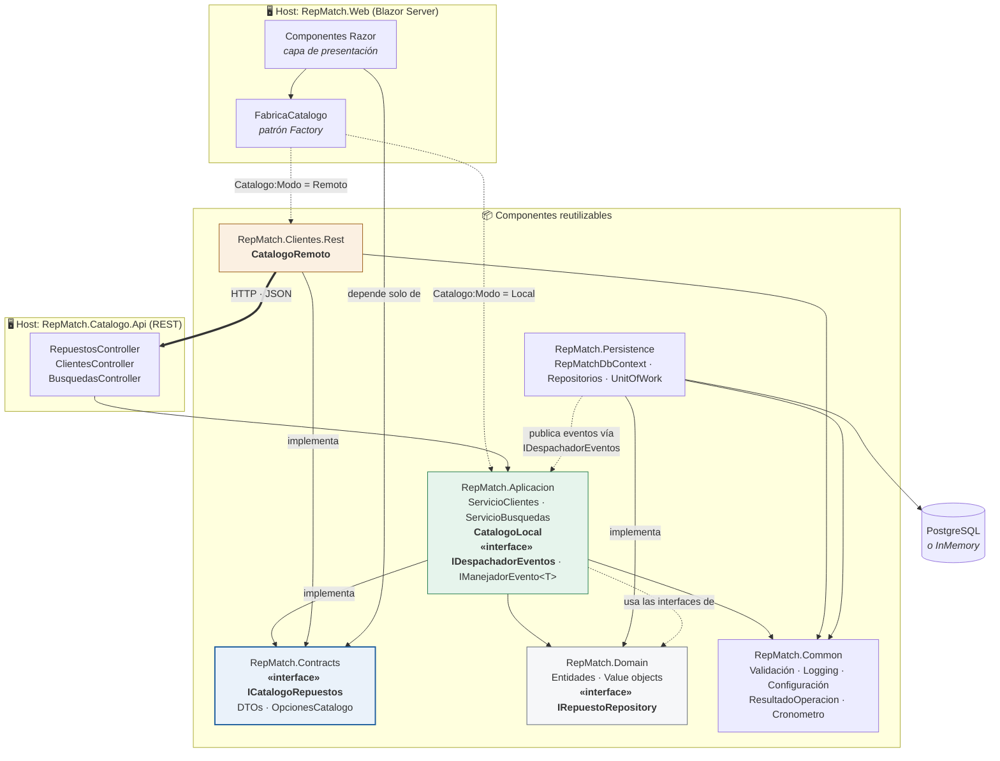

# Diagrama de componentes — RepMatch

Seis componentes reutilizables e independientes (la consigna pide un mínimo de tres) más dos hosts
ejecutables. Cada componente es un proyecto .NET separado con sus propias dependencias declaradas
en NuGet.

## Componentes

| Componente | Tipo según la consigna | Contenido | Depende de |
|---|---|---|---|
| `RepMatch.Domain` | **Dominio** | Entidades, value objects, eventos e interfaces de repositorio | *nada* |
| `RepMatch.Persistence` | **Acceso a datos** | `DbContext`, mapeos, repositorios, unidad de trabajo (que además despacha los eventos de dominio) | Domain, Common, Aplicacion (sólo `IDespachadorEventos`) |
| `RepMatch.Common` | **Utilidad** | Validación, logging, configuración, `ResultadoOperacion<T>`, medición de latencia, correlación | *nada del proyecto* |
| `RepMatch.Contracts` | Contratos | DTOs, `ICatalogoRepuestos`, `OpcionesCatalogo` | *nada del proyecto* |
| `RepMatch.Aplicacion` | Lógica de negocio | Servicios, mapeadores, validadores, `CatalogoLocal`, despachador y manejadores de eventos de dominio | Domain, Common, Contracts |
| `RepMatch.Clientes.Rest` | Adaptador remoto | `CatalogoRemoto`, propagación de correlación | Common, Contracts |

## Diagrama



## Acceso local vs. remoto

Éste es el ejercicio central del TP Inicial, y el diagrama lo muestra en el par de flechas punteadas
que salen de `FabricaCatalogo`.

**Una sola interfaz, dos implementaciones:**

```csharp
public interface ICatalogoRepuestos
{
    string Modo { get; }                       // "Local" | "Remoto" — para las evidencias
    Task<IReadOnlyList<RepuestoDto>> BuscarCompatiblesAsync(VehiculoDto v, string? sistema, CancellationToken ct);
    Task<RepuestoDto?> ObtenerPorCodigoAsync(string codigo, CancellationToken ct);
    Task<IReadOnlyList<RepuestoDto>> ListarAsync(CancellationToken ct);
}
```

| | Local | Remoto |
|---|---|---|
| Implementación | `Aplicacion.Catalogo.CatalogoLocal` | `Clientes.Rest.CatalogoRemoto` |
| Mecanismo | Invocación directa en proceso, por referencia de proyecto | HTTP + JSON contra `Catalogo.Api` |
| Recorrido | `CatalogoLocal → IRepuestoRepository → EF Core → BD` | `HttpClient → GET /api/repuestos/compatibles → CatalogoLocal (en el otro proceso) → BD` |
| Serialización | ninguna | JSON de ida y vuelta |
| Latencia medida (caliente) | **~1,9 ms** | **~12,6 ms** |

La selección se hace en `RepMatch.Web/Servicios/FabricaCatalogo.cs`, leyendo la clave
`Catalogo:Modo` (o la variable de entorno `Catalogo__Modo`). **No hay recompilación de por medio**, y
ningún consumidor —ni los componentes Razor, ni `ServicioBusquedas`— se entera de cuál está enchufada.

En la Segunda Parte se agrega una tercera implementación, `CatalogoSoapClient` sobre CoreWCF, sin
tocar ni la interfaz ni sus consumidores.

## Inversión de dependencias

La flecha que va de `Persistence` a `Domain` dice **implementa**, no "usa": las interfaces
`IRepuestoRepository`, `IClienteRepository`, `IBusquedaRepository` e `IUnitOfWork` están declaradas
en el dominio, y la capa de datos las implementa. Por eso `Domain` no depende de nada y puede
testearse sin base de datos ni contenedores.

## Eventos de dominio (Observer)

Las entidades sólo **acumulan** eventos en `EntidadBase.EventosDominio` (`Busqueda` registra
`BusquedaCreada` al nacer); no conocen a nadie que los escuche. El circuito se cierra fuera del
dominio:

```
ServicioBusquedas.CrearAsync
  └─ UnitOfWork.ConfirmarAsync          (Persistence)
       ├─ SaveChangesAsync              ← la transacción se confirma primero
       ├─ recolecta EventosDominio de las entidades rastreadas y vacía los buzones
       └─ IDespachadorEventos.DespacharAsync   (Aplicacion)
            └─ por cada evento, resuelve del contenedor todos los IManejadorEvento<TEvento>
                 └─ ManejadorLogBusquedaCreada  (deja la búsqueda en el log, con su CorrelationId)
```

Reglas del despachador in-process (`DespachadorEventosEnProceso`):

- Se publica **después** de confirmar, así nunca se notifica algo que la base terminó revirtiendo.
- Los buzones se vacían antes de despachar: cada evento se publica **una sola vez** por
  confirmación, aunque un manejador vuelva a confirmar.
- Un manejador que falla **se registra en el log y se sigue** con el resto: la transacción ya está
  confirmada y no hay nada que revertir.
- Sumar un observador es registrar otro `IManejadorEvento<T>` en el contenedor. Nada más cambia.

`Persistence` referencia a `Aplicacion` únicamente por `IDespachadorEventos`. Es la dirección
habitual de la arquitectura limpia (infraestructura → aplicación → dominio) y no hay ciclo:
`Aplicacion` sigue sin conocer a `Persistence`. En la Segunda Parte el despachador in-process se
reemplaza por uno que publica en RabbitMQ, sin tocar ni las entidades ni los manejadores.

## Patrones aplicados (anticipo de la Primera Parte)

| Patrón | Dónde | Para qué |
|---|---|---|
| **Factory** | `FabricaCatalogo` | Elegir la implementación del catálogo según configuración |
| **Strategy** | `ICatalogoRepuestos` con dos implementaciones | Intercambiar el mecanismo de acceso sin tocar consumidores |
| **Repository** | `I*Repository` en Domain, implementados en Persistence | Aislar el dominio del motor de datos |
| **Unit of Work** | `IUnitOfWork` / `UnitOfWork` | Confirmar cambios como una transacción |
| **Adapter** | `CatalogoRemoto` | Adaptar un contrato HTTP a la interfaz del dominio |
| **Observer** | `EntidadBase.EventosDominio` → `UnitOfWork` → `IDespachadorEventos` → `IManejadorEvento<T>` | Notificar `BusquedaCreada` a los manejadores registrados sin que las entidades conozcan a nadie; base de la mensajería de la Segunda Parte |
