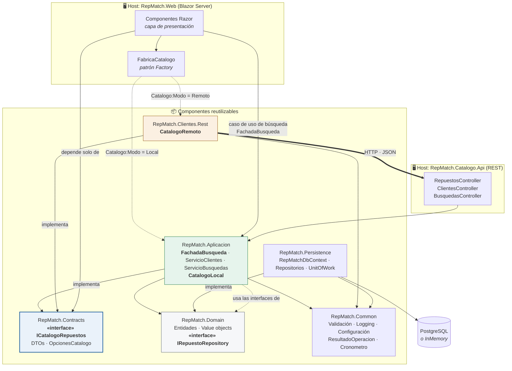

# Diagrama de componentes — RepMatch

Seis componentes reutilizables e independientes (la consigna pide un mínimo de tres) más dos hosts
ejecutables. Cada componente es un proyecto .NET separado con sus propias dependencias declaradas
en NuGet.

## Componentes

| Componente | Tipo según la consigna | Contenido | Depende de |
|---|---|---|---|
| `RepMatch.Domain` | **Dominio** | Entidades, value objects, eventos e interfaces de repositorio | *nada* |
| `RepMatch.Persistence` | **Acceso a datos** | `DbContext`, mapeos, repositorios, unidad de trabajo | Domain, Common |
| `RepMatch.Common` | **Utilidad** | Validación, logging, configuración, `ResultadoOperacion<T>`, medición de latencia, correlación | *nada del proyecto* |
| `RepMatch.Contracts` | Contratos | DTOs, `ICatalogoRepuestos`, `OpcionesCatalogo` | *nada del proyecto* |
| `RepMatch.Aplicacion` | Lógica de negocio | `FachadaBusqueda` (Facade), servicios, mapeadores, validadores, `CatalogoLocal` | Domain, Common, Contracts |
| `RepMatch.Clientes.Rest` | Adaptador remoto | `CatalogoRemoto`, propagación de correlación | Common, Contracts |

## Diagrama



## Acceso local vs. remoto

Éste es el ejercicio central del TP Inicial, y el diagrama lo muestra en el par de flechas punteadas
que salen de `FabricaCatalogo`.

**Una sola interfaz, dos implementaciones:**

```csharp
public interface ICatalogoRepuestos
{
    string Modo { get; }                       // "Local" | "Remoto" — para las evidencias
    Task<IReadOnlyList<RepuestoDto>> BuscarCompatiblesAsync(VehiculoDto v, string? sistema, CancellationToken ct);
    Task<RepuestoDto?> ObtenerPorCodigoAsync(string codigo, CancellationToken ct);
    Task<IReadOnlyList<RepuestoDto>> ListarAsync(CancellationToken ct);
}
```

| | Local | Remoto |
|---|---|---|
| Implementación | `Aplicacion.Catalogo.CatalogoLocal` | `Clientes.Rest.CatalogoRemoto` |
| Mecanismo | Invocación directa en proceso, por referencia de proyecto | HTTP + JSON contra `Catalogo.Api` |
| Recorrido | `CatalogoLocal → IRepuestoRepository → EF Core → BD` | `HttpClient → GET /api/repuestos/compatibles → CatalogoLocal (en el otro proceso) → BD` |
| Serialización | ninguna | JSON de ida y vuelta |
| Latencia medida (caliente) | **~1,9 ms** | **~12,6 ms** |

La selección se hace en `RepMatch.Web/Servicios/FabricaCatalogo.cs`, leyendo la clave
`Catalogo:Modo` (o la variable de entorno `Catalogo__Modo`). **No hay recompilación de por medio**, y
ningún consumidor —ni los componentes Razor, ni la `FachadaBusqueda` que lo consulta— se entera de cuál está enchufada.

En la Segunda Parte se agrega una tercera implementación, `CatalogoSoapClient` sobre CoreWCF, sin
tocar ni la interfaz ni sus consumidores.

## Inversión de dependencias

La flecha que va de `Persistence` a `Domain` dice **implementa**, no "usa": las interfaces
`IRepuestoRepository`, `IClienteRepository`, `IBusquedaRepository` e `IUnitOfWork` están declaradas
en el dominio, y la capa de datos las implementa. Por eso `Domain` no depende de nada y puede
testearse sin base de datos ni contenedores.

## Fachada del caso de uso de búsqueda (Facade)

Crear una búsqueda no es una operación sino una secuencia, y en la Segunda Parte esa secuencia suma
tres colaboradores más. `FachadaBusqueda` (`RepMatch.Aplicacion/Fachadas/`) es la única puerta de
entrada que ve la presentación: `Busquedas.razor` y el `POST` de `BusquedasController` llaman a
`ResolverBusquedaAsync` y no conocen a nadie más.

```
FachadaBusqueda.ResolverBusquedaAsync(CrearBusquedaDto) → ResultadoOperacion<BusquedaDto>
  ├─ 1 · Admisión          ServicioBusquedas.ValidarAsync             validador + cliente existente
  ├─ 2 · Códigos objetivo  ICatalogoRepuestos.BuscarCompatiblesAsync  Local o Remoto, según la fábrica
  │        ▸ PUNTO DE EXTENSIÓN  diagnóstico por IA (#15, #16)
  │        ▸ PUNTO DE EXTENSIÓN  compatibilidad SOAP (#10, #11)
  ├─ 3 · Registro          ServicioBusquedas.RegistrarAsync           agregado + UnitOfWork → eventos
  └─ 4 · Ofertas
           ▸ PUNTO DE EXTENSIÓN  agregador de ofertas + ServicioOfertas (#4, #19)
```

Reglas de la fachada:

- **No tiene reglas de negocio propias.** Las de admisión están en los validadores y en
  `ServicioBusquedas`; las del agregado (asignar códigos o marcar la búsqueda como fallida) en
  `Busqueda`. La fachada fija el orden, corta el flujo cuando un paso falla y nada más.
- **Traduce la infraestructura a resultados.** Un timeout, un DNS que no resuelve o un 5xx del
  catálogo remoto vuelven como `ResultadoOperacion.Falla(...)`; la pantalla dejó de necesitar
  `try/catch`. Una cancelación pedida por el llamador sí se propaga.
- **Es la única puerta.** `ValidarAsync` y `RegistrarAsync` son `internal`: desde fuera de
  `RepMatch.Aplicacion` no hay otra forma de crear una búsqueda. El compilador hace cumplir el patrón.
- **`ServicioBusquedas` ya no conoce el catálogo.** Recibe la lista de códigos objetivo sin saber si
  salió del catálogo o, mañana, de la IA. Ése es el punto de extensión que la Segunda Parte necesita.

Las pruebas de la orquestación están en `tests/RepMatch.Tests/Aplicacion/FachadaBusquedaTests.cs`.

## Patrones aplicados (anticipo de la Primera Parte)

| Patrón | Dónde | Para qué |
|---|---|---|
| **Factory** | `FabricaCatalogo` | Elegir la implementación del catálogo según configuración |
| **Strategy** | `ICatalogoRepuestos` con dos implementaciones | Intercambiar el mecanismo de acceso sin tocar consumidores |
| **Facade** | `FachadaBusqueda` (`Aplicacion/Fachadas/`) | Una única operación, `ResolverBusquedaAsync`, para todo el caso de uso de búsqueda: la presentación no conoce los colaboradores que orquesta hoy ni los tres que se suman en la Segunda Parte |
| **Repository** | `I*Repository` en Domain, implementados en Persistence | Aislar el dominio del motor de datos |
| **Unit of Work** | `IUnitOfWork` / `UnitOfWork` | Confirmar cambios como una transacción |
| **Adapter** | `CatalogoRemoto` | Adaptar un contrato HTTP a la interfaz del dominio |
| **Observer** *(sembrado)* | `EntidadBase.EventosDominio` | Base para los eventos de dominio y, luego, la mensajería |
