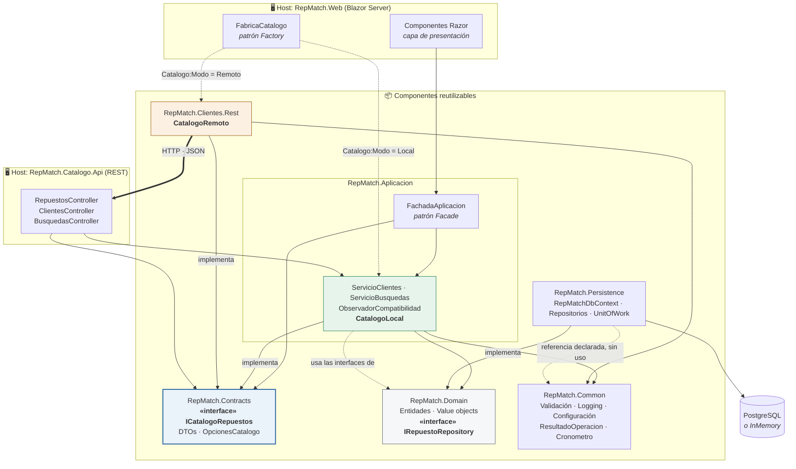

# Diagrama de componentes — RepMatch

Seis componentes reutilizables e independientes (la consigna pide un mínimo de tres) más dos hosts
ejecutables. Cada componente es un proyecto .NET separado, cada uno con su `.csproj` y sus
referencias declaradas.

## Componentes

| Componente | Tipo según la consigna | Contenido | Depende de |
|---|---|---|---|
| `RepMatch.Domain` | **Dominio** | Entidades, value objects, eventos e interfaces de repositorio | *nada* |
| `RepMatch.Persistence` | **Acceso a datos** | `DbContext`, mapeos, repositorios, unidad de trabajo | Domain (y una referencia declarada a Common que hoy ningún archivo usa) |
| `RepMatch.Common` | **Utilidad** | Validación, logging, configuración, `ResultadoOperacion<T>`, medición de latencia, correlación | *nada del proyecto* |
| `RepMatch.Contracts` | Contratos | DTOs, `ICatalogoRepuestos`, `OpcionesCatalogo` | *nada del proyecto* |
| `RepMatch.Aplicacion` | Lógica de negocio | Servicios, `FachadaAplicacion`, despacho y observadores de eventos, mapeadores, validadores, `CatalogoLocal` | Domain, Common, Contracts |
| `RepMatch.Clientes.Rest` | Adaptador remoto | `CatalogoRemoto`, propagación de correlación | Common, Contracts |

## Diagrama


```mermaid
flowchart TB
    subgraph host_web["🖥️ Host: RepMatch.Web (Blazor Server)"]
        UI["Componentes Razor<br/><i>capa de presentación</i>"]
        FCAT["FabricaCatalogo<br/><i>patrón Factory</i>"]
    end

    subgraph host_api["🖥️ Host: RepMatch.Catalogo.Api (REST)"]
        CTRL["RepuestosController<br/>ClientesController<br/>BusquedasController"]
    end

    subgraph comp["📦 Componentes reutilizables"]
        subgraph app_sub["RepMatch.Aplicacion"]
            FACH["FachadaAplicacion<br/><i>patrón Facade</i>"]
            APP["ServicioClientes · ServicioBusquedas<br/>ObservadorCompatibilidad<br/><b>CatalogoLocal</b>"]
        end
        REST["RepMatch.Clientes.Rest<br/><b>CatalogoRemoto</b>"]
        CON["RepMatch.Contracts<br/><b>«interface» ICatalogoRepuestos</b><br/>DTOs · OpcionesCatalogo"]
        PER["RepMatch.Persistence<br/>RepMatchDbContext · Repositorios · UnitOfWork"]
        DOM["RepMatch.Domain<br/>Entidades · Value objects<br/><b>«interface» IRepuestoRepository</b>"]
        COM["RepMatch.Common<br/>Validación · Logging · Configuración<br/>ResultadoOperacion · Cronometro"]
    end

    BD[("PostgreSQL<br/><i>o InMemory</i>")]

    UI --> FACH
    FACH --> APP
    FACH --> CON
    FCAT -. "Catalogo:Modo = Local" .-> APP
    FCAT -. "Catalogo:Modo = Remoto" .-> REST

    APP -- implementa --> CON
    REST -- implementa --> CON

    REST == "HTTP · JSON" ==> CTRL
    CTRL --> APP
    CTRL --> CON

    APP --> DOM
    APP --> COM
    REST --> COM
    PER -- implementa --> DOM
    PER -. "referencia declarada, sin uso" .-> COM
    PER --> BD

    APP -. "usa las interfaces de" .-> DOM

    style CON fill:#eaf2fa,stroke:#1f5f9e,stroke-width:2px
    style APP fill:#e6f4ec,stroke:#1f7a4d
    style REST fill:#fbf0e2,stroke:#9a5b13
    style DOM fill:#f6f7f9,stroke:#5b6472
```

## Acceso local vs. remoto

Éste es el ejercicio central del TP Inicial, y el diagrama lo muestra en el par de flechas punteadas
que salen de `FabricaCatalogo`.

**Una sola interfaz, dos implementaciones:**

```csharp
// src/RepMatch.Contracts/ICatalogoRepuestos.cs (fragmento, sin comentarios XML)
public interface ICatalogoRepuestos
{
    string Modo { get; }

    Task<IReadOnlyList<RepuestoDto>> BuscarCompatiblesAsync(
        VehiculoDto vehiculo, string? sistema = null, CancellationToken ct = default);

    Task<RepuestoDto?> ObtenerPorCodigoAsync(string codigoCanonico, CancellationToken ct = default);

    Task<IReadOnlyList<RepuestoDto>> ListarAsync(CancellationToken ct = default);
}
```

| | Local | Remoto |
|---|---|---|
| Implementación | `Aplicacion.Catalogo.CatalogoLocal` | `Clientes.Rest.CatalogoRemoto` |
| Mecanismo | Invocación directa en proceso, por referencia de proyecto | HTTP + JSON contra `Catalogo.Api` |
| Recorrido | `CatalogoLocal → IRepuestoRepository → EF Core → BD` | `HttpClient → GET /api/repuestos/compatibles → CatalogoLocal (en el otro proceso) → BD` |
| Serialización | ninguna | JSON de ida y vuelta |
| Latencia en régimen (mediana) | **~2 ms** | **~7 ms** |

La selección se hace en `RepMatch.Web/Servicios/FabricaCatalogo.cs`, leyendo la clave
`Catalogo:Modo` (o la variable de entorno `Catalogo__Modo`). **No hay recompilación de por medio**, y
ningún consumidor —ni `FachadaAplicacion`, ni `ObservadorCompatibilidad`— se entera de cuál está enchufada.

Para la Segunda Parte está previsto agregar una tercera implementación sobre SOAP (CoreWCF), sin
tocar ni la interfaz ni sus consumidores. Todavía no existe en el código: hoy solo están
`CatalogoLocal` y `CatalogoRemoto`.

## Inversión de dependencias

La flecha que va de `Persistence` a `Domain` dice **implementa**, no "usa": las interfaces
`IRepuestoRepository`, `IClienteRepository`, `IBusquedaRepository` e `IUnitOfWork` están declaradas
en el dominio, y la capa de datos las implementa. Por eso `Domain` no depende de nada y puede
testearse sin base de datos ni contenedores.

## Patrones aplicados

Resumen. La justificación de cada uno, con el problema concreto que resuelve y la alternativa que se
descartó, está en [docs/patrones.md](../patrones.md).

| Patrón | Dónde | Para qué |
|---|---|---|
| **Factory** | `FabricaCatalogo` | Elegir la implementación del catálogo según configuración |
| **Strategy** | `ICatalogoRepuestos` con dos implementaciones | Intercambiar el mecanismo de acceso sin tocar consumidores |
| **Repository** | `I*Repository` en Domain, implementados en Persistence | Aislar el dominio del motor de datos |
| **Unit of Work** | `IUnitOfWork` / `UnitOfWork` | Confirmar cambios como una transacción |
| **Adapter** | `CatalogoRemoto` | Adaptar un contrato HTTP a la interfaz `ICatalogoRepuestos` de `RepMatch.Contracts` |
| **Observer** | `DespachadorEventos` y `ObservadorCompatibilidad` | `BusquedaCreada` completa los códigos sin que `ServicioBusquedas` conozca el catálogo |
| **Facade** | `FachadaAplicacion` | Única puerta de la presentación hacia clientes, búsquedas y catálogo |
