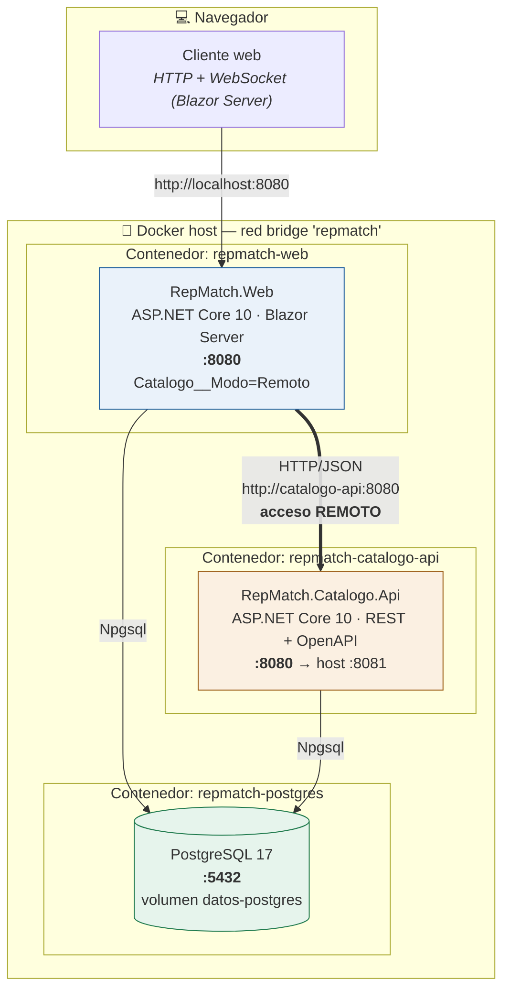
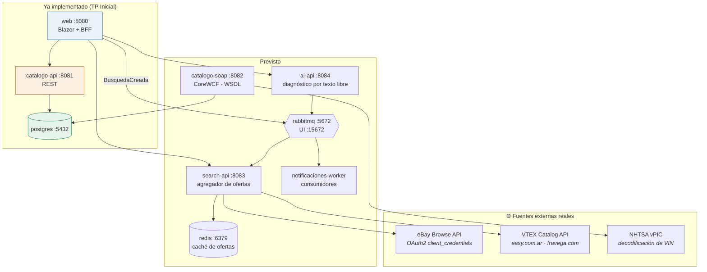

# Diagrama de despliegue — RepMatch

Dos topologías: la del **TP Inicial**, que es la que está implementada y se levanta con
`docker compose up`, y la **prevista** para las entregas siguientes, que se documenta acá para
mostrar que la arquitectura actual la admite sin rediseño.

## TP Inicial — implementado



### Nodos

| Nodo | Imagen | Puerto host | Rol |
|---|---|---|---|
| `repmatch-web` | build desde `src/RepMatch.Web/Dockerfile` | 8080 | Capa de presentación + factory del catálogo |
| `repmatch-catalogo-api` | build desde `src/RepMatch.Catalogo.Api/Dockerfile` | 8081 | Host remoto del componente de catálogo |
| `repmatch-postgres` | `postgres:17-alpine` | 5432 | Persistencia, con volumen nombrado |

Las imágenes .NET son multi-etapa: se compila con `mcr.microsoft.com/dotnet/sdk:10.0` y se publica
sobre `mcr.microsoft.com/dotnet/aspnet:10.0`, que no lleva compilador. Ambos servicios corren como
usuario `app`, sin privilegios de root.

`postgres` declara un `healthcheck` con `pg_isready` y los servicios .NET dependen de
`condition: service_healthy`: sin eso, la API arranca antes de que la base acepte conexiones. Como
segunda red de seguridad, `ExtensionesPersistencia.InicializarBaseAsync` reintenta hasta diez veces
con espera creciente.

### Los dos modos de ejecución

| Modo | Cómo se levanta | Qué demuestra |
|---|---|---|
| **Local** | `Catalogo__Modo=Local` | Invocación directa en proceso: la Web resuelve el catálogo por referencia de proyecto y no genera tráfico hacia `catalogo-api` |
| **Remoto** | `Catalogo__Modo=Remoto` *(por defecto en compose)* | Invocación remota: cada consulta sale por HTTP al otro contenedor, y el mismo `X-Correlation-Id` aparece en los logs de ambos |

Fuera de contenedores, para desarrollo:

```bash
dotnet run --project src/RepMatch.Catalogo.Api --urls http://localhost:5081
```

```bash
dotnet run --project src/RepMatch.Web --urls http://localhost:5080
```

## Topología prevista — Primera, Segunda Parte e Integrador

Ninguno de los nodos nuevos obliga a cambiar los componentes ya construidos: `search-api` consume el
mismo `ICatalogoRepuestos`, y `catalogo-soap` será una tercera implementación de esa interfaz.



### Requisitos externos de la topología prevista

| Servicio | Credenciales | Estado verificado |
|---|---|---|
| eBay Browse API | App ID + Cert ID (registro gratuito) | 5000 llamadas/día |
| VTEX `easy.com.ar` | ninguna | ✅ HTTP 206 con autopartes reales |
| VTEX `fravega.com` | ninguna | ✅ HTTP 206 |
| NHTSA vPIC | ninguna | ✅ HTTP 200 |
| MercadoLibre | — | ❌ descartado: `403 forbidden`, cerraron la búsqueda pública |
