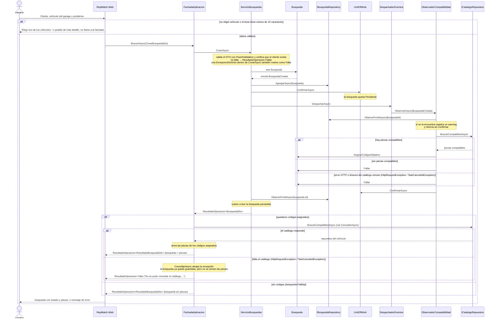
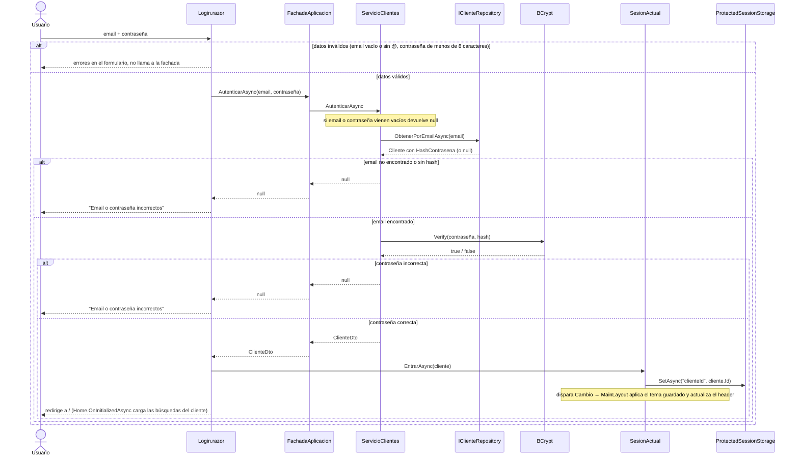
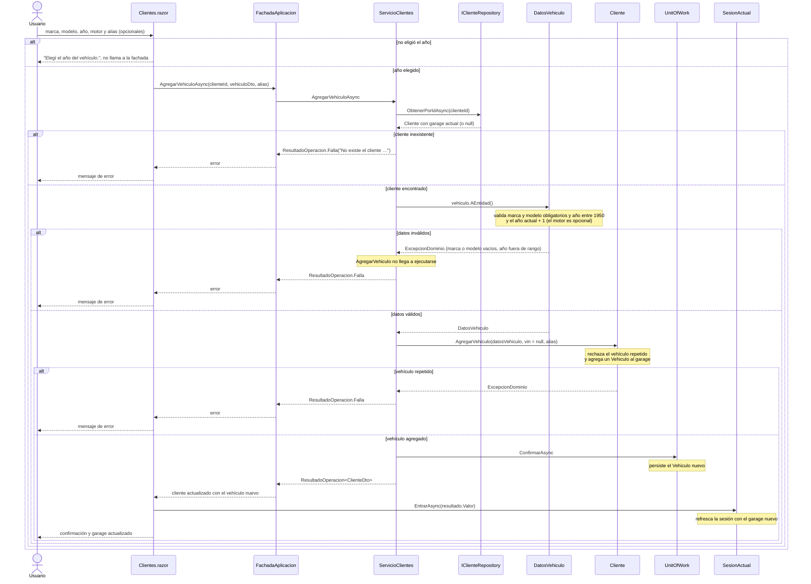

# Diagramas de secuencia

---

## 1. Registrar una búsqueda

Caso de la Primera Parte: el cliente elige un vehículo del garage, describe el problema, y la
búsqueda queda guardada con los códigos de las piezas compatibles. El texto libre se persiste. La
elección de piezas la hace el observador de `BusquedaCreada`, por compatibilidad de vehículo; la
fachada después arma las piezas completas para mostrarlas.

---

## 2. Autenticación (login)

El usuario ingresa con email y contraseña. La contraseña nunca se almacena: solo su hash BCrypt.
`SesionActual` guarda el id del cliente en el almacenamiento de sesión del browser, cifrado por
ASP.NET Core Data Protection. El registro de una cuenta nueva usa otro camino desde la misma
pantalla: `RegistrarClienteAsync` (validación FluentValidation, rechazo de email duplicado y
`BCrypt.HashPassword`) y después `EntrarAsync`.

---

## 3. Alta de un vehículo

El cliente agrega un auto a su garage. Las reglas de negocio viven en el dominio: marca y modelo
obligatorios y año entre 1950 y el año actual + 1 (`DatosVehiculo`), vehículo no repetido para el
mismo cliente (`Cliente.AgregarVehiculo`) y VIN válido si se informa (`Vehiculo`; la Web no manda
VIN). `AgregarVehiculoAsync` no usa FluentValidation ni duplica esa lógica: busca el cliente,
delega en el dominio y persiste.

