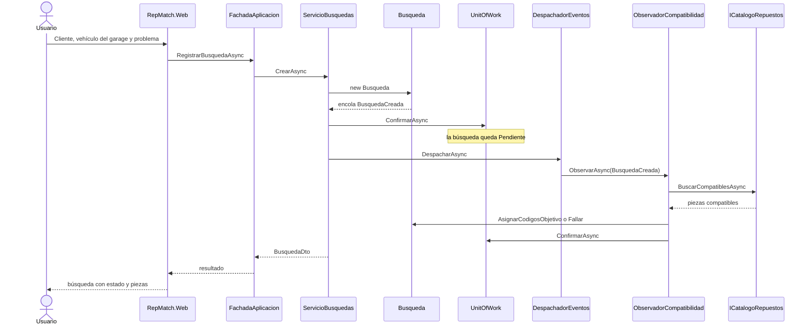

# Diagrama de secuencia — registrar una búsqueda

Caso de la Primera Parte: el cliente elige un vehículo del garage, describe el problema, y la
búsqueda queda guardada con las piezas compatibles. El texto libre se persiste. La elección de
piezas la hace el observador de `BusquedaCreada`, por compatibilidad de vehículo.

